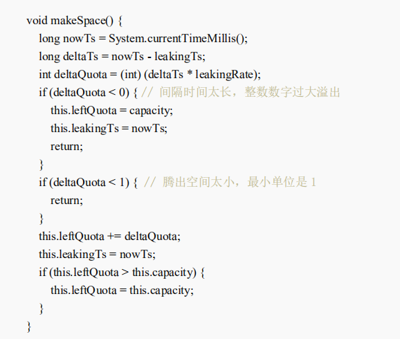
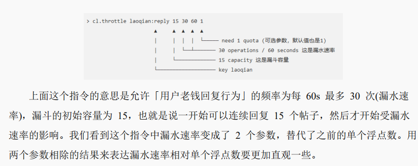

# Redis深度历险

## Redis基础数据结构

Redis有五种数据结构，分别是String，List，set，hash和Zset。

### String

Redis所有的数据结构都是以唯一的key字符串作为名称。

不同类型的数据结构的差异就是value的结构不一样。

常见的用途：缓存用户信息，将用户信息结构体使用JSON序列化为字符串，然后将字符串塞进Redis进行缓存。

内部结构：类似ArrayList，采用预分配冗余空间的方式来减少内存的频繁分配。

- 当字符串长度<1M，扩容是加倍现有空间。
- 超过1M，扩容是一次多扩容1M的空间。

### list

内部结构：类似LinkedList，插入和删除都非常快，但是索引的定位慢。

常见用途：异步队列，将需要延后处理的任务结构体序列化为字符串塞进Redis列表，另一个线程从这个列表中轮询数据进行处理。

常见函数：

- lindex：getIndex()， 需要对列表进行遍历。
- ltrim：将区间内的信息保留，一般用来生成定长的列表。

快速列表：真正的list底层使用的quicklist的结构。

- 当列表元素比较少：使用一块连续的内存存储，ziplist。
- 当数据量比较多：将链表和ziplist组合，将多个ziplist使用双向指针串联使用。

### hash

内部结构：类似HashMap，数组+链表。

字典的值只能是字符串。

采用了渐进式rehash策略；

常见用途：对用户结构中的每个字段单独存储。

### set

内部结构：类似HashSet，内部键值对无序唯一。

常见用途：存储活动中奖用户的ID，因为有自动去重的功能。

### zset

内部结构：类似SortedSet和HashMap的结合，真正的实现是用跳表的形式。

常见用途：存储学生的成绩，value是学生的ID，score是考试成绩。

支持随机的插入和删除。

#### 跳表


### 容器型数据结构的通用规则

如果容器不存在，就创建一个再进行操作。

如果容器中的元素没有了，就立即删除元素并释放内存。

### 分布式锁

本质：使用Redis来占用进程，当别的客户端进来时发现被占用就放弃或者稍后重试。

指令：加入set指令的扩展参数，使用setnx和expire一起执行。

实现可重入性：对客户端的set方法进行包装，使用线程的ThreadLocal存储当前持有锁的计数。

## 应用：延时队列

对于只有一组消费者的消息队列，使用Redis可以轻松搞定。

Redis的list常用来作为异步消息队列使用。

- rpush/lpush用来入队
- lpop/rpop用来出队

对于客户端的空轮询状况，让线程sleep1s，来解决。——对于多个消费者性能下降明显。

使用blpop/brpop来解决。

### 延时队列的实现

通过zset来进行实现。

将消息序列化成一个字符串做为zset中的value，到期处理时间做为score，使用多个线程轮询zset获取到期的任务进行处理。

同一个任务可能会被多个进程/线程抢到，通过zrem来决定唯一的属主。


## 布隆过滤器

如果历史记录等存放在关系数据库里，去重就需要频繁地对数据库进行exist查询，当系统并发量比较高的时候，数据库很难抗住压力。

布隆过滤器专门用来解决这种去重问题，空间还能节省90%，只是稍微有点不精确，同时也有一定的误判率。

简单理解：不精确的set，使用contains方法来判断时可能会发生误判。

基本指令：
- bf.add：添加元素。
- bf.exists：查询元素是否存在。
- bf.madd：一次添加多个元素。
- bf.mexists：一次查询多个元素是否存在。

### 原理

每个布隆过滤器对应到Redis的数据结构就是一个大型的位数组和几个不一样的无偏hash函数(无偏就是能够把元素划分的比较均匀)。

添加元素：多个hash函数对key进行hash算得一个整数索引值然后对数组长度进行取模得到一个位置，每个hash得到不同的位置，再把位数组的这些位置都置1就完成了add操作。

查询元素：把hash的几个位置都算出来，判断位数组中的这些位置是否为1.
- 如果有一个为0，说明这个key不存在。
- 如果都是1，也不能说明这个key一定存在。

### 空间占用估计
k = 0.7 * (l / n)
f = 0.6185 ^ (l /n)
n：预计元素的数量， f：容错率， l：位数组的长度， k：hash函数的最佳数量。

### 结论

位数组相对越长(l / n)，错误率f就越低。

位数组相对越长(l / n)， hash函数需要的最佳数量也越多，影响计算效率。

当一个元素平均需要一个字节(8bit)的指纹空间时，错误率约为2%。

### 扩展应用

布隆过滤器可以显著降低数据库的IO请求数量。

当用户来查询某个row时，可以先通过内存中的布隆过滤器过滤到大量不存在的row请求，然后再去磁盘进行查询。

邮件系统的垃圾邮箱过滤功能也普遍用到了布隆过滤器。

## 限流

场景：指定用户的某个行为在特定时间内只允许发生一定的次数

### 简单限流

使用``zset``这个数据结构，通过``score``来圈出这个时间窗口。

zset的value值只需要保证唯一性，所以可以使用毫秒时间戳。

通过统计滑动窗口内的行为数量与阈值进行比较就可以得出当前的行为是否允许。

### 漏斗限流

通过指定漏斗的容量、水流速率、漏斗的剩余空间、上一次漏水时间来实现限流。



如果要实现分布式，Redis4.0提供了``redis-cell``模块，使用了原子算法，并提供了原子的限流指令。

```b
cl.throttle key:reply capacity operation seconds 1
失败的重试时间会直接返回。
```



## 附近的人的实现

使用``GEO``模块来实现附近的人，mobike，餐馆等功能。

### GeoHash算法

将二维的经纬度数据映射到一维的整数，所有的元素都将挂载到一条线上，距离近的二维坐标映射到一维后的点之间的距离也会接近。

编码之后每一个地图元素的坐标都将会变成一个整数。

GeoHash算法会对这个整数再做一次base32编码生成一个字符串，放入``zset``中。

其中value是元素的key， score是Geohash的52位整数值。

### Geo指令的使用

当成一个普通的``zset``。

```BASH
geoadd 集合名称 经纬度 元素名称
geodist 集合名称 两个元素名称 距离单位   #计算距离
geopos 集合名称 元素  # 获取集合中任意元素的经纬度坐标
georadiusbymember 集合名称 元素 距离 数量 排序方式 # 查询指定元素附近的其他元素
georadius 集合名称 坐标值 距离 数量 排序方式 #根据坐标值来查找附近的元素
```

Geo数据使用单独的redis实例部署，而不是集群环境，因为数据量过大会因为节点的迁移造成卡顿的现象。

如果数据量过大就需要对Geo数据进行拆分，显著降低单个zset集合的大小。